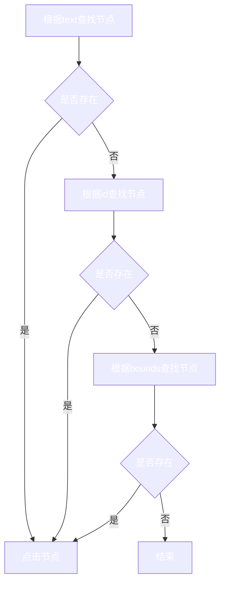

# 核心逻辑

## 实现原理

利用 Android 无障碍服务，获取当前窗口对象，遍历窗口节点，当节点符合指定条件时，执行点击的动作。

## 核心逻辑

主要分为以下几个步骤：

```mermaid
graph
    A[根据text查找节点] --> B{是否存在}
    B -- 是 --> C[点击节点]
    B -- 否 --> D[根据id查找节点] --> E{是否存在}
    E -- 是 --> C
    E -- 否 --> F[根据bounds查找节点] --> G{是否存在}
    G -- 是 --> C
    G -- 否 --> H[结束]

    classDef default color:#fff;
```
